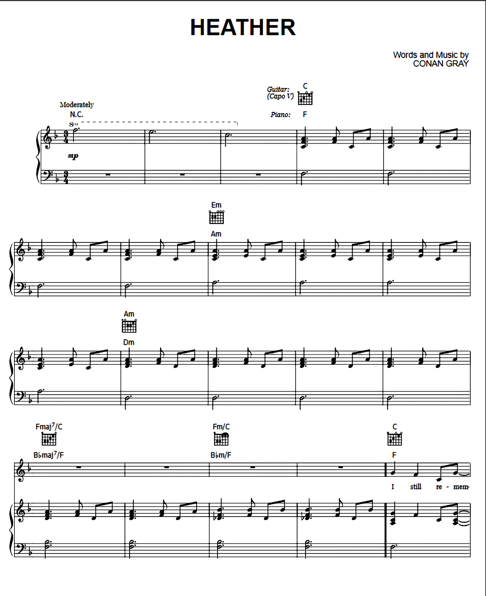
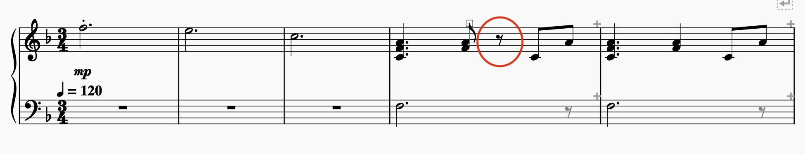
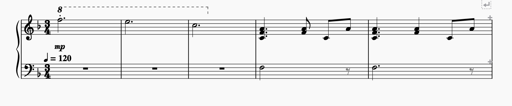

# Task: 

 

The main aspect not properly transcribed by the OMR engine was the first two bars, where some notes were missing. However, the main issue and struggle was the additional voice that was added on top of the piano notes, ‘the voice’ line and bars did not have any notes on them either, hence the empty line. This is a very different issue from the group work on Tuesday, as on Tuesday we used a more complicated piece of work. Additionally, the piece that the group used on Tuesday was not retrieved from Muscore, which could be why the piece used in the individual labs came out with fewer faults. Update, trial and error,  the issue was solved through the upper settings and changing the instruments, as well as removing the solo voice. 
## Task issues: 
 
In the first segment that got transcribed, after the voice was removed, the OMR added a rest and would not allow removal. Once the program was restarted, the issue was solved, furthermore–– the pitch was removed, in addition to some of the notes turned to be half notes instead of full notes. The first 10 Bars had to be altered in addition to the removal of the second voice in the final version for this task. 

### Final edited version:
The final version of the 10 edited the first bars, removed the voice and added/changed notes and, pitch. [edited file](musescore_edited_10Bars.mscz))
 
