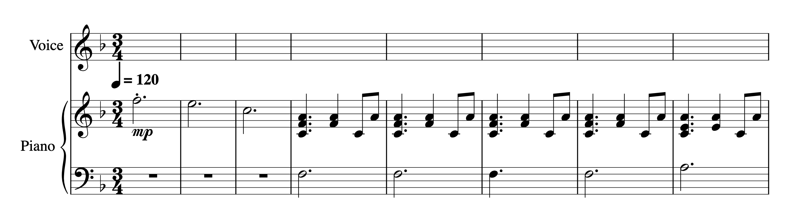

# MCA-2023

[week 1](week1.md)
[week 2](week2.md)
[week 3](week3.md)
[week 4](week4.md)
[week 5](week5.md)
[week 7](week7.md)
[week 8](week8.md)
[week 9](week9.md)
[week 10](week10.md)

# Task - MusicXML and MEI files:  
Using the created [musescore](musescore_edited_10Bars.mscz) file from last week for this week's activity. It was unfortunately a challenge to create a file and convert the score through the MusicXML converter (see image below) as the website wouldn’t convert the score, no matter what file was used. This result was achieved despite different types of files uploaded it simply wouldn't work. 
 

## Task - To be continued...
The issue has been resolved and [MusicXML]
*  [MEI file](data/Heatherfullscore.mei)
*  [MusicXML](data/Heatherfullscore.musicxml)
*  [Previous week edited MusicXML File](data/plsworkyworky.musicxml)
  * The files were created and issues identified, the reason Verovio would not run is due to the files being saved and uploaded incorrectly.
  * The files should have been uploaded uncompressed - to achieve the following result see images below of the result. 
# Verovio 
[Verovio HTML File](verovio.html)
 
## Differences and Similarities 
- MEI is a simpler form to read and is more flexible for music encoding purposes. MusicXML is designed to exchange music notation data between software easily, both are designed for music encoding. MEI is an easier type of file to read hence more adaptable and allows more detail. (the changes and same text can be seen in the HTML file)
