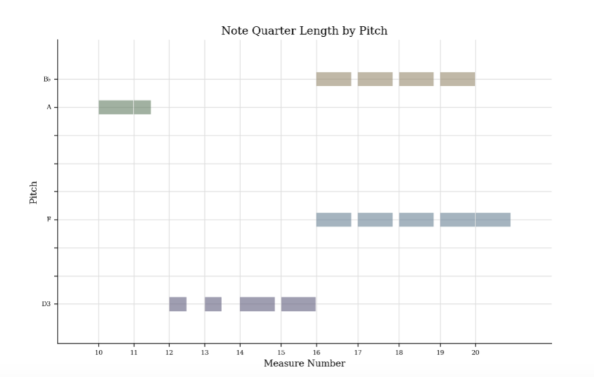
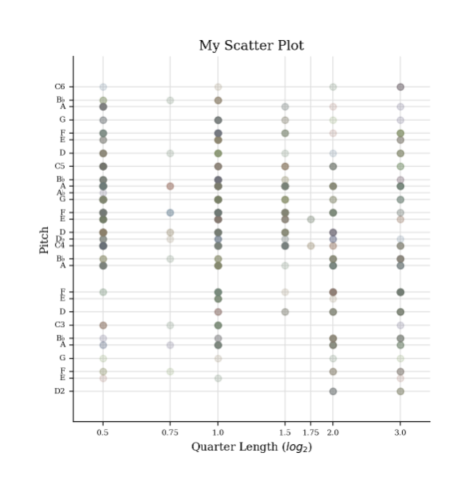
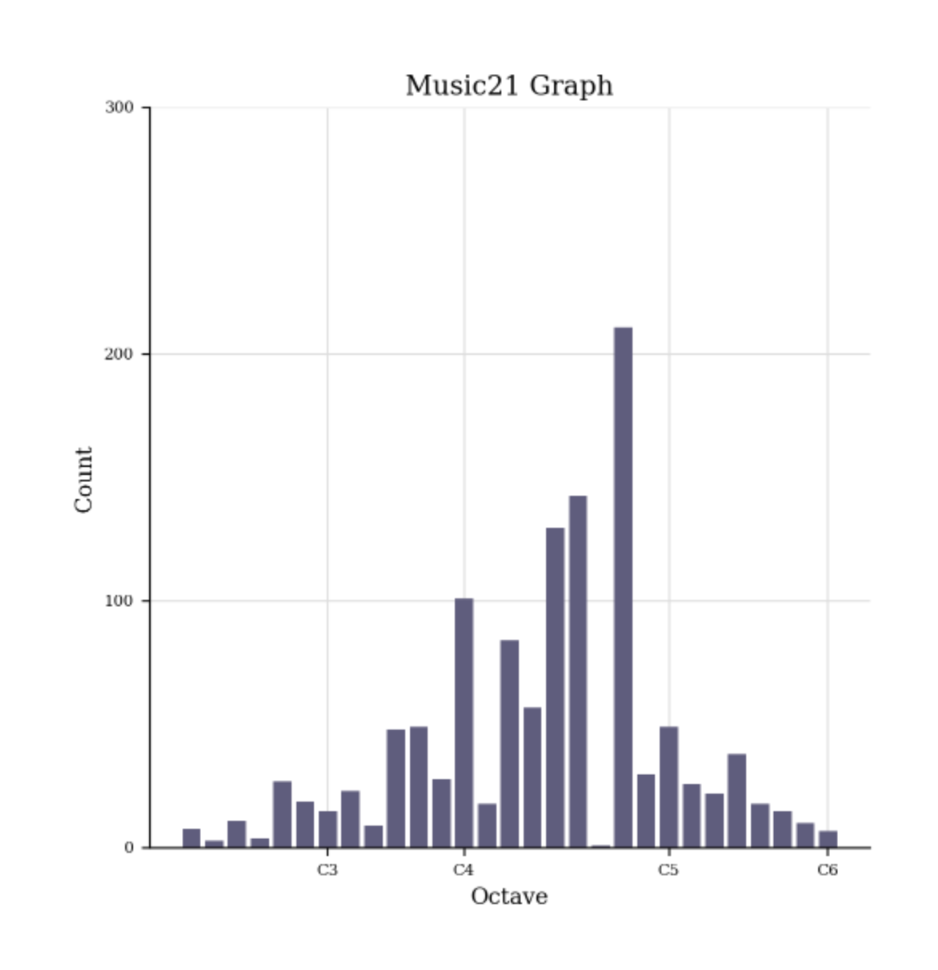

# MCA-2023

[week 1](week1.md)
[week 2](week2.md)
[week 3](week3.md)
[week 4](week4.md)
[week 5](week5.md)
[week 7](week7.md)
[week 8](week8.md)
[week 9](week9.md)
[week 10](week10.md)

# Required Task (2)
## Music21 and Python Work
Integrating Analysis Files through [jupyter](http://localhost:8889/notebooks/Intro%20to%20music21.ipynb)  
### Note Quarter Length by Pitch 

### Scatter plot of Pitches

### Music21 Graph

