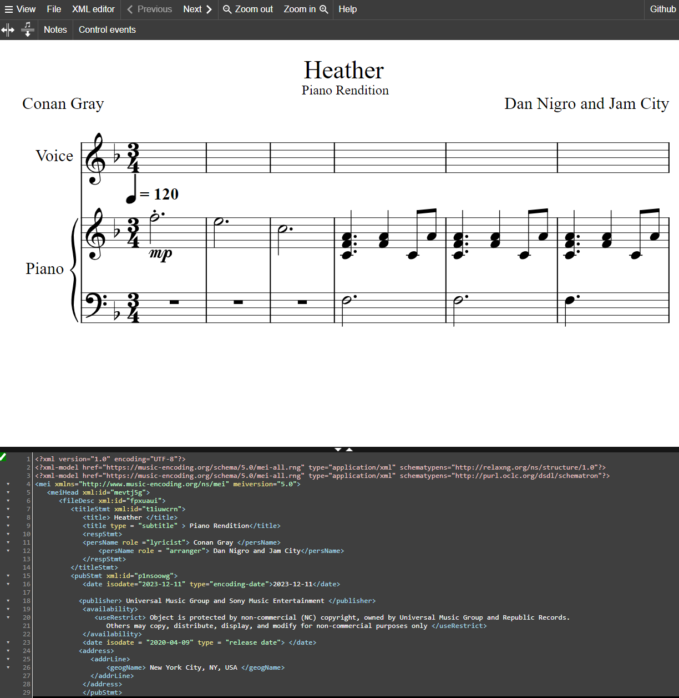

# MCA-2023

[week 1](week1.md)
[week 2](week2.md)
[week 3](week3.md)
[week 4](week4.md)
[week 5](week5.md)
[week 7](week7.md)
[week 8](week8.md)
[week 9](week9.md)
[week 10](week10.md)

------------------------------------------------------------

# Task - Standards in Curation
### METADATA SCHEMA - what was included and what should have been included 
* In The Updated [MEI](JS/Heatherfullscore(2).mei) file, certain points such as file description, and licensing date is missing as well as the genre of classification. 
* To reflect on what should have been included for further metadata, see the following list: 
Information about music-specific genres for musical objects, in this case, it is POP, a source of metadata is [YouTube](https://youtu.be/24u3NoPvgMw?feature=shared), it is important to mention the copyright belongs to Universal Music Group & Republic Records	and is protected by copyright.

       
#### Verovio Work Illustrated P.1
 

#### Verovio Work Illustraed P.2
* An updated version of the, Verovio MEI file screenshot from the work done
 

